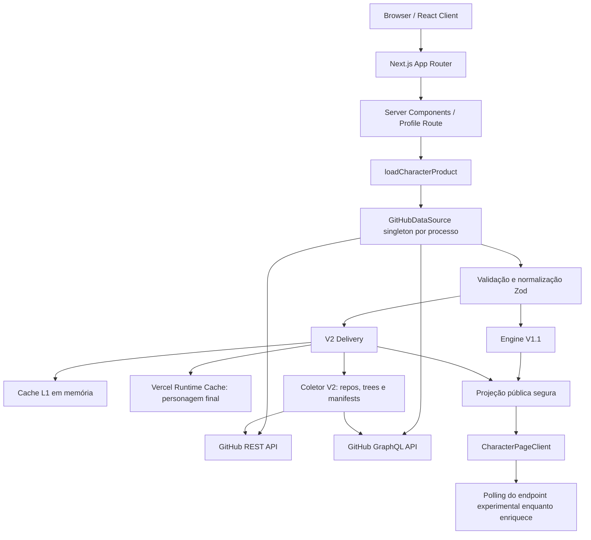
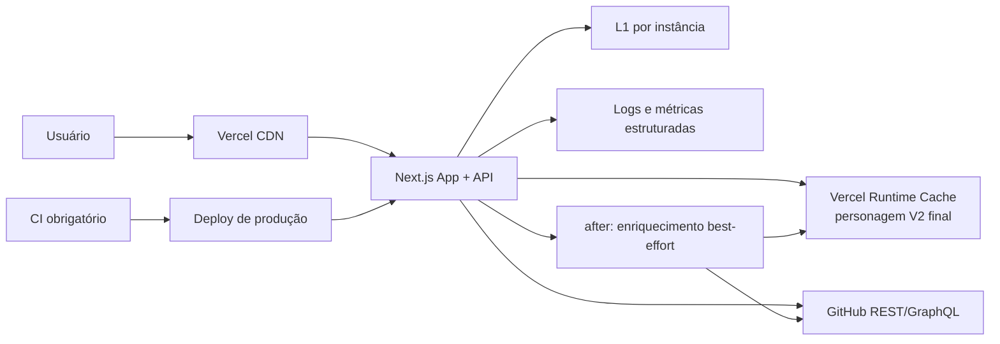

# Auditoria Técnica Completa — GitHub RPG

**Data da auditoria:** 8 de outubro de 2026  
**Repositório:** `GitHubRPG`  
**Branch e revisão auditadas:** `main` — `86f663615e67932f050e9670a8ce1286cef18b38`  
**Produção verificada:** `https://githubrpg.vercel.app`  
**Natureza do trabalho:** auditoria somente leitura; nenhuma correção, dependência, configuração, commit, push ou deploy foi realizado.

## Metodologia e limites da evidência

Esta auditoria combina cinco tipos de evidência:

1. leitura estática do código, configurações, testes e documentação;
2. inspeção do grafo de imports internos (218 arquivos-fonte não-teste, 745 arestas);
3. medições versionadas existentes em `artifacts/game-v2-performance`;
4. inspeção read-only do projeto e do deployment atual pela Vercel CLI;
5. smoke tests HTTP e inspeção visual/semântica da produção em desktop e viewport estreito.

Os comandos completos de lint, typecheck, testes e build **não foram executados nesta auditoria**, pois podem criar ou atualizar caches, `.next` e artefatos, contrariando a restrição de não alterar arquivos. Há duas evidências substitutas, que não devem ser confundidas com uma validação local completa:

- o deployment atual da Vercel, correspondente exatamente ao commit auditado, está `READY` e concluiu o build;
- a suíte histórica do commit anterior `92e6340` registrou 1.086 testes unitários/integrados e 54 E2E aprovados, mas isso **não prova** a suíte do commit atual.

Severidades usadas:

- **CRÍTICO:** exploração ou falha grave atual, com dano imediato ou indisponibilidade material;
- **ALTO:** risco real e exposto, ou lacuna operacional capaz de causar indisponibilidade/lançamento defeituoso;
- **MÉDIO:** dívida concreta com impacto limitado, condicional ou mitigado;
- **BAIXO:** melhoria preventiva ou risco predominantemente teórico.

---

## 1. Executive Summary

O GitHub RPG está tecnicamente bem estruturado para o estágio atual. A aplicação tem separação clara entre obtenção de dados, normalização, engines, projeção pública e interface; mantém o fluxo REST anônimo; usa GraphQL em lote quando há token; trata 404 corretamente; possui cache em múltiplas camadas; e preserva a V1 como resposta rápida e fallback quando a V2 não está disponível. A produção atual foi verificada no mesmo commit da auditoria e responde corretamente.

Não foi encontrado nenhum risco **CRÍTICO** comprovado que justifique migração emergencial ou interrupção do produto. Também não foram encontrados ciclos no grafo de imports, vazamento de token em arquivos versionados, exposição da evidência interna da V2 ou erro bruto da API na interface.

Os maiores problemas reais hoje não estão no cálculo local da engine nem na capacidade bruta da Vercel. Eles são:

1. **ausência de um gate de CI antes do deploy de produção** — um push em `main` pode ser publicado sem lint, typecheck, testes e E2E obrigatórios;
2. **ausência de proteção global contra abuso e orçamento compartilhado de chamadas ao GitHub** — uma sequência de usernames válidos e distintos pode furar o cache e consumir o token/rate limit;
3. **cold path V2 caro em I/O e fan-out** — média medida de 19,9 s e p95 de 52,7 s, dominados pelo GitHub e pelo coletor, não pela CPU da engine;
4. **documentação de rollout divergente da produção** — documentos ainda descrevem a V2 como não liberada, enquanto a UI de produção já a serve globalmente;
5. **observabilidade e coordenação distribuída incompletas** — single-flight e limites de enriquecimento são por processo, portanto múltiplas instâncias ainda podem repetir o mesmo trabalho frio;
6. **polling com estado terminal e casos operacionais incompletos** — a implementação evita overlap e vazamentos, mas pode deixar a interface em mensagem de análise indefinida depois do esgotamento das tentativas.

### Decisões executivas

| Questão | Decisão | Motivo principal |
|---|---|---|
| VPS agora? | **A) NÃO NECESSÁRIA** | O gargalo é GitHub/I/O; VPS adiciona operação e não remove rate limits. |
| PostgreSQL agora? | **A) NÃO NECESSÁRIO** | Não há estado de produto durável que exija banco; o cache final compartilhado já funciona. |
| Redis agora? | **NÃO** | Não existe evidência de volume/contenda que justifique outro serviço. |
| Worker/queue agora? | **NÃO** | Torna-se recomendável quando houver fila real, bursts ou volume próximo de milhares de cold users/dia. |
| Docker agora? | **Baixa prioridade** | Pouco benefício no deploy Vercel atual; útil se houver CI reprodutível mais complexo ou futura migração. |
| Manter a V1? | **SIM** | É resposta imediata, fallback e dependência de Chronicle, Duelo, badge e card. |
| Estratégia final | **ESTRATÉGIA A — continuar totalmente na Vercel** | Corrigir gates, proteção, observabilidade e UX antes de adicionar infraestrutura. |

---

## 2. Current Architecture

### 2.1 Fluxo principal

O ponto de orquestração do backend é [`src/data/loadCharacter.ts`](src/data/loadCharacter.ts). Ele carrega e normaliza o perfil, calcula a V1, prepara Chronicle/explicações e tenta anexar a V2 quando o feature flag está habilitado. Uma falha da V2 não derruba a ficha V1.

O acesso ao GitHub fica centralizado em [`src/data/github.ts`](src/data/github.ts) e seus módulos auxiliares. O datasource é singleton por processo, com:

- cache L1 de 15 minutos, até 500 perfis;
- cache negativo de 404 por 60 segundos;
- deduplicação de requests em andamento dentro do processo;
- timeout de 10 segundos por operação;
- retry limitado para falhas de rede e 502/503/504;
- concorrência máxima de 6 por processo;
- gate fail-fast quando o rate limit conhecido se esgota.

### 2.2 Fluxo V1

Com token, o perfil vem por REST e os repositórios são paginados por GraphQL em páginas de 50, até 20 páginas. Linguagens usam bytes de `languages.edges.size`; quando GraphQL retorna `null` ou uma lista truncada, existe fallback REST `/languages`, limitado e concorrente. Sem token, permanece o fluxo REST anônimo, incluindo paginação de até 10 páginas de 100 repositórios.

A V1 ignora forks nas estatísticas de trabalho próprio, mas não remove forks indiscriminadamente de toda a aplicação. Ela continua sendo a base funcional da ficha e dos consumidores que ainda não foram migrados.

### 2.3 Fluxo V2

A V2 atual identifica-se como `2.0-experimental-v24-evo`, com schema, catálogo, detectores e balanceamento versionados na chave de cache. O coletor:

- obtém a lista de repositórios novamente;
- seleciona até 30 repositórios relevantes;
- busca árvores recursivas;
- seleciona até 10 manifests por repositório e 180 por perfil;
- usa batches GraphQL de 30 manifests quando há token;
- mantém fallback REST, limitado a 90 requests de manifest;
- usa concorrência de árvore igual a 6;
- calcula o resultado de forma determinística a partir da evidência normalizada.

A projeção pública entrega a ficha calculada, explicações, conquistas e títulos, mas não entrega paths de manifests, bounds internos, dados brutos de evidência, rate limits ou token.

### 2.4 Rotas e superfícies

As superfícies públicas principais são:

- página de perfil `/{username}`;
- `/api/characters/{username}`;
- `/api/experimental/v2/characters/{username}`;
- `/api/heroes`;
- rotas de badge;
- rotas de card/social image.

A página de perfil agenda enriquecimento em background quando necessário; o Hall usa lookup sem iniciar novo enriquecimento. Badge, card, Chronicle e Duelo continuam dependentes da V1.

### 2.5 Deployment atual

O deployment de produção auditado está `READY`, no commit `86f6636`, região `iad1`, Node.js 24, com 2 GB de memória e 1 vCPU. As funções usam limite padrão de 300 s, exceto o endpoint experimental V2 configurado em 60 s. As variáveis presentes em produção são `GITHUB_DATA_SOURCE`, `GITHUB_TOKEN` e `GAME_ENGINE_V2_UI_ENABLED`; os valores não foram lidos nem expostos.

Não há workflows em `.github/workflows`. A integração Git/Vercel automatiza o deploy, mas o repositório não contém um pipeline que prove lint, tipos, testes e E2E antes da publicação.

---

## 3. Strengths

### Dados e arquitetura

- Separação consistente entre datasource, normalização, engines e apresentação.
- V1 e V2 têm fronteiras explícitas; falha V2 degrada para V1 em vez de derrubar a página.
- Compatibilidade REST anônima preservada.
- GraphQL usa paginação de 50 repositórios e linguagens por bytes reais.
- Fallback REST de linguagens é limitado e aplicado a casos relevantes.
- Schemas Zod reduzem o risco de confiar cegamente em respostas externas incompletas.
- Chaves da V2 incluem versões do engine/schema/detectores/catálogo/balanceamento e fingerprint da fonte, evitando colisões semânticas entre versões.
- Engine local é barata: scoring médio medido em aproximadamente 4 ms; parsing em 0,07 ms.

### Resiliência e cache

- Cache negativo para 404 evita repetição desnecessária.
- In-flight deduplication existe nos caminhos principais dentro da mesma instância.
- Cache final V2 usa L1 e Vercel Runtime Cache L2, com envelope validado e limite de tamanho.
- A decisão de armazenar no L2 apenas o personagem final é tecnicamente correta: os payloads finais ficaram abaixo de 184 KB, enquanto evidências reais chegaram a 3,7 MB e ultrapassaram o limite de 2 MB da Runtime Cache em 8 de 70 amostras.
- O resultado final é determinístico e versionado; corridas entre instâncias geram custo duplicado, mas não deveriam produzir estados logicamente conflitantes para a mesma chave.

### Segurança e privacidade

- Nenhum segredo real foi encontrado em arquivos versionados.
- Token é server-only; não há variante `NEXT_PUBLIC_`.
- Username é validado com formato estrito antes de compor requests.
- Bases de URL do GitHub são fixas, reduzindo risco de SSRF na coleta principal.
- XML do badge escapa conteúdo dinâmico e aplica CSP/sandbox/nosniff.
- Erros técnicos são convertidos em mensagens amigáveis.
- A projeção pública V2 não expõe evidência bruta nem detalhes do coletor.
- Perfil inexistente retorna HTTP 404 real, sem ficha mock residual.

### Frontend e acessibilidade

- A produção não apresentou erro ou warning no console durante a inspeção.
- Não houve overflow horizontal em 1.432 px úteis nem no viewport estreito observado.
- Tabs implementam navegação por setas, Home e End.
- O diálogo de compartilhamento tem trap de foco, Escape, restauração do foco e bloqueio de scroll.
- Existem guardas de `prefers-reduced-motion`.
- Imagens observadas possuem dimensões, reduzindo layout shift.
- O modal pesado de compartilhamento é carregado dinamicamente.

### Testes e engenharia

- O repositório contém 81 arquivos de testes unitários/integrados e uma suíte E2E ampla.
- Datasource, engines, cache, projeção, rotas e componentes críticos têm cobertura dedicada.
- O grafo estático não apresentou dependência circular entre os 218 arquivos-fonte analisados.
- A produção confirmou canonical e URLs Open Graph/Twitter absolutas para o host público atual.

---

## 4. Critical Findings

Não há achado classificado como **CRÍTICO** comprovado. Os achados de maior prioridade são **ALTOS**.

### ALTO — Deploy automático sem gate de qualidade no repositório

**Estado:** problema atual e comprovado.  
**Evidência:** inexistência de `.github/workflows`; deploy Vercel conectado ao Git.  
**Impacto:** uma alteração que compila, mas quebra tipos fora do build, testes, comportamento E2E ou contratos pode chegar a produção automaticamente.  
**Por que é alto:** o projeto já possui suíte relevante, porém ela não é autoridade obrigatória do release. O build atual estar verde não substitui esse gate.

**Recomendação:** criar, em tarefa separada, checks obrigatórios de lint, typecheck, unit/integration e build em PR; executar E2E seletivo ou completo antes da promoção de produção. Manter o fluxo simples de push/merge, mas condicionar o deployment de produção à aprovação dos checks.

### ALTO — Endpoint caro sem proteção global contra abuso

**Estado:** superfície atual; exploração não foi observada.  
**Evidência:** rotas públicas aceitam qualquer username válido; cold misses acionam GitHub e podem agendar coleta V2; limites e deduplicação são por processo.  
**Impacto:** um atacante ou crawler pode variar usernames, evitar cache e consumir rapidamente rate limit, duração de função e quota de memória.  
**Mitigações existentes:** validação de username, cache, concorrência local, limite de repositórios/manifests e gate local de rate limit.  
**Lacuna:** não há orçamento global por IP/identidade/projeto, nem circuit breaker compartilhado entre instâncias.

**Recomendação:** antes de adicionar banco ou VPS, implementar política de rate/budget global compatível com a plataforma, limites específicos para enriquecimento, telemetria de cold misses e resposta amigável com retry. Não registrar tokens nem dados sensíveis.

### ALTO — Documentação de rollout contradiz a produção

**Estado:** problema atual e comprovado.  
**Evidência:** documentos ainda afirmam “PREVIEW FAILED — DO NOT ROLLOUT” e descrevem ausência de integração pública; a produção atual serve V2 globalmente e não possui allowlist de produção.  
**Impacto:** decisões operacionais, incidentes e futuras alterações podem partir de uma autoridade desatualizada. Isso também enfraquece a distinção entre experimental, preview e produção.

**Recomendação:** reconciliar README, documentos de validação, status do rollout, owner e rollback num único registro de decisão. Não alterar o engine ao fazer essa correção documental.

### MÉDIO — Headroom pequeno no endpoint V2 de 60 s

**Estado:** risco atual, não falha observada.  
**Evidência:** p95 frio medido em 52,658 s; endpoint tem limite de 60 s; o orçamento interno usa 55 s.  
**Impacto:** variância de GitHub, rate limiting ou cold start pode consumir a margem restante.  
**Interpretação:** aumentar timeout não corrige o gargalo; apenas mascara o fan-out. A página principal possui limite maior e a UI recebe V1, então a arquitetura já reduz o impacto ao usuário.

### MÉDIO — Duplicação entre instâncias no enriquecimento frio

**Estado:** limitação atual, custo ainda não quantificado em produção.  
**Evidência:** single-flight, filas e contadores residem em mapas locais do processo; Runtime Cache compartilha resultados, mas não fornece lock atômico usado pelo código.  
**Impacto:** dois cold requests simultâneos em instâncias distintas podem fazer o mesmo trabalho e consumir rate limit duplicado.  
**Recomendação:** primeiro medir taxa de duplicação. Adicionar coordenação durável somente se os dados justificarem.

---

## 5. Performance

### 5.1 Resultados medidos

O baseline versionado de 15 perfis registra:

| Métrica cold path | Resultado |
|---|---:|
| Média | 19,883 s |
| p50 | 13,222 s |
| p90 | 47,421 s |
| p95 / máximo | 52,658 s |

Distribuição média do tempo:

| Etapa | Média | Participação aproximada |
|---|---:|---:|
| Perfil + V1 | 14,893 s | 74,9% |
| Seleção de repositórios | 0,838 s | 4,2% |
| Trees | 1,759 s | 8,8% |
| Manifests | 2,389 s | 12,0% |
| Parsing | 0,07 ms | desprezível |
| Scoring | 4,06 ms | desprezível |

O número médio adicional de operações V2 foi 23,93 REST e 2,4 GraphQL por cold profile; no p90, 31 REST e 5 GraphQL. Trees responderam pela maior parte das requests REST.

### 5.2 Gargalo principal

O gargalo é uma combinação de:

1. latência e paginação do GitHub no carregamento base/V1;
2. segunda descoberta de repositórios para a V2;
3. fan-out de trees e manifests;
4. cauda longa de perfis grandes.

Não é um problema de CPU da engine, React, banco ausente ou capacidade de cálculo da Vercel. Mover o mesmo algoritmo para uma VPS manteria as mesmas chamadas externas e provavelmente pioraria a operação sem reduzir materialmente o p95.

### 5.3 Medições da produção atual

Smoke tests realizados em 8 de outubro de 2026:

| Recurso | Resultado observado |
|---|---|
| Home | 200; TTFB aproximado 271 ms; resposta privada/no-store |
| `/torvalds` | 200; TTFB aproximado 232 ms; HTML ~140 KB |
| API V1 | primeiro request ~2,59 s; hits posteriores ~39–45 ms |
| Endpoint V2 já cacheado | 200; origem L2/L1; resposta total ainda ~2 s |
| Badge | primeiro ~188 ms; hits ~38–44 ms |
| Card | primeiro ~1,97 s; hits ~46–61 ms |
| Perfil inexistente | 404 real; ~310 ms |

O endpoint V2 cacheado ainda carrega o perfil/V1 antes de resolver a chave final, por isso um hit L2 não implica resposta HTTP próxima de zero. O lookup interno cacheado foi 0 ms, mas o request completo manteve custo de upstream/base.

### 5.4 Frontend

O frontend observado é responsivo e não apresentou layout overflow. Os principais custos potenciais são:

- `CharacterPageClient` como orquestrador de muitas features;
- 54 conquistas montadas simultaneamente na tab correspondente;
- CSS de perfil com mais de 1.300 linhas;
- hidratação de várias áreas interativas;
- polling durante enriquecimento frio;
- root layout forçado a dinâmico por decisão global, atingindo páginas que poderiam ter shell estático.

Esses custos são reais, mas secundários diante do cold path do GitHub. Não há evidência para uma reescrita de frontend.

---

## 6. V2 Cold Path

### 6.1 Sequência atual

1. perfil e dados base são carregados e normalizados;
2. V1 é calculada e pode ser renderizada imediatamente;
3. a V2 procura resultado final em L1/L2;
4. em cold miss, seleciona até 30 repositórios;
5. obtém árvores e identifica manifests relevantes;
6. carrega até 180 manifests, por GraphQL em lote ou REST limitado;
7. normaliza evidência, detecta sinais, pontua e produz a ficha;
8. grava o personagem final em cache;
9. o cliente consulta o endpoint experimental até receber o resultado.

### 6.2 Avaliação do coletor

Os limites são bons e evitam explosão sem controle. Entretanto, a V2 faz uma chamada própria a `/users/{user}/repos?per_page=100` e considera apenas essa página antes de selecionar 30 repositórios. Para usuários com mais de 100 repositórios, a seleção pode ignorar repositórios posteriores sem que a cobertura comunique explicitamente essa omissão. Isso é uma dívida de correção/explicabilidade **MÉDIA**, não um bug crítico, porque o produto já declara estados parciais e impõe limites deliberados.

O caminho sem token degrada corretamente para REST, mas o teto de 90 requests de manifest pode produzir cobertura parcial. Isso é preferível a centenas de requests silenciosos, desde que o estado parcial permaneça visível e não seja tratado como evidência completa.

### 6.3 Estado e polling

O hook [`src/features/character/useLiveCharacterPresentation.ts`](src/features/character/useLiveCharacterPresentation.ts) agenda seis tentativas em aproximadamente 4, 4, 8, 12, 16 e 16 segundos. Ele:

- usa requests sequenciais, sem overlap;
- aborta ao desmontar ou mudar de username;
- limpa timers;
- usa `credentials: omit` e `cache: no-store`;
- só adota payload compatível com a versão esperada.

Avaliação: **ACEITÁVEL, COM LACUNAS OPERACIONAIS**.

Lacunas:

- não existe estado terminal explícito quando as tentativas acabam;
- `Retry-After` e sinais de rate limit não orientam o intervalo;
- não há integração com Page Visibility;
- se já existe V2 stale, o hook não acompanha a atualização em background;
- a validação do payload é manual e acoplada à versão exata;
- faltam testes focados em retry, exaustão, navegação, aba em background, rate limit e stale refresh.

### 6.4 O que otimizar primeiro

Ordem recomendada, sem alterar regra de jogo:

1. medir cada chamada e resultado do cold enrichment em produção;
2. eliminar trabalho duplicado comprovado entre carregamento base e seleção V2, sem misturar contratos;
3. tornar cobertura >100 repositórios explicitamente parcial ou paginar de modo controlado;
4. responder ao cliente com estados terminais/retry coerentes;
5. só então avaliar lock distribuído ou fila.

---

## 7. Cache

### 7.1 Camadas atuais

| Camada | Conteúdo | TTL/limite principal |
|---|---|---|
| Datasource L1 | perfil normalizado | 15 min, 500 entradas |
| Cache negativo | 404 | 60 s |
| Tree L1 | árvore de repositório | 6 h, 2.000 entradas |
| Manifest L1 | conteúdo/resultado de manifest | 24 h, 5.000 entradas |
| Evidência V2 L1 | evidência normalizada | fresh 6 h + stale 18 h, 250 entradas |
| Personagem V2 L1 | projeção final | fresh 1 h + stale 23 h, 250 entradas |
| Runtime Cache L2 | personagem V2 final | compartilhado entre deployments do mesmo ambiente |
| CDN Vercel | API V1, badge e card conforme headers | observado em produção |

### 7.2 O que está correto

- Chaves versionadas evitam que uma engine nova reutilize resultado semanticamente antigo.
- Runtime Cache compartilha o resultado final entre instâncias e deployments.
- Envelope valida schema, versão, tipo e expiração; entradas inválidas são removidas.
- Não persistir a evidência completa no L2 evita ultrapassar o limite oficial de 2 MB por item da Vercel Runtime Cache. A documentação oficial confirma esse limite e o escopo por projeto/ambiente: [Vercel Functions package — Runtime Cache](https://vercel.com/docs/functions/functions-api-reference/vercel-functions-package).

### 7.3 Inconsistências e riscos

- Single-flight é local. O L2 resolve reaproveitamento depois da gravação, mas não impede duas computações simultâneas.
- A atualização stale em background não se reflete automaticamente na página já aberta.
- A home e outras páginas herdam renderização dinâmica/no-store do root layout, reduzindo benefício de cache onde não há necessidade de personalização.
- A Runtime Cache não deve ser tratada como banco: mudanças de TTL/tags não são reconciliação transacional entre deployments; chaves versionadas continuam obrigatórias.

### 7.4 Política recomendada

Manter a arquitetura atual. Antes de introduzir Redis ou PostgreSQL:

- instrumentar `miss`, `l1`, `l2`, `stale`, `enrichment_started`, `duplicate_suspected`, duração e erro;
- definir SLO de cold/warm;
- separar shell estático de conteúdo dependente de ambiente quando isso puder ser feito localmente;
- medir a taxa real de trabalhos duplicados;
- manter payload final como unidade compartilhada de cache.

---

## 8. Security

### 8.1 Segredos

**Resposta objetiva: não foi encontrado token ou segredo real exposto em arquivos versionados, bundle ou respostas públicas.**

O único padrão semelhante a token encontrado no repositório é um valor explicitamente fictício em teste. `.env.local` está ignorado e contém nomes esperados de variáveis, mas seus valores não foram lidos. A inspeção da Vercel confirmou apenas nomes e marcação sensível, sem revelar valores.

### 8.2 Pontos fortes

- validação forte de username;
- URLs de coleta base fixas;
- sem `eval` ou construção dinâmica equivalente identificada;
- único `dangerouslySetInnerHTML` relevante usa SVG procedural interno, não input arbitrário do usuário;
- token não vai ao cliente;
- erros são sanitizados;
- badge escapa XML;
- projeção V2 não expõe evidência interna.

### 8.3 Achados

#### ALTO — Ausência de controle global de abuso

Detalhado na seção 4. É o risco de segurança/ disponibilidade mais relevante.

#### MÉDIO — Dependências com advisories

`npm audit` reporta 14 advisories no grafo completo: 2 críticos, 8 altos e 4 moderados. No grafo de produção (`--omit=dev`), restam 2 advisories ligados ao Next/PostCSS embutido.

O caminho concreto de exploração por CSS/source map controlado por atacante **não está presente no produto auditado**. Portanto, classificar o produto como “criticamente vulnerável” seria mais forte que a evidência. Ainda assim, os advisories são reais e exigem plano de upgrade testado, especialmente porque versões maiores disponíveis incluem mudanças de compatibilidade.

#### BAIXO — Fetch de avatar no card confia no host recebido do GitHub

O card aceita uma URL HTTPS normalizada a partir de `avatar_url` e a busca no servidor sem allowlist de host, limite explícito de bytes ou validação rígida de content-type. Hoje a origem é um payload validado do GitHub, então não há input público direto demonstrado. É hardening preventivo: restringir hosts esperados, tamanho, redirects e tipo antes de crescimento.

#### MÉDIO — Headers de defesa incompletos na aplicação principal

Produção possui HSTS, mas não apresentou CSP global, `X-Content-Type-Options`, `Referrer-Policy` ou `Permissions-Policy`, e expõe `X-Powered-By: Next.js`. A ausência não comprova exploração, mas reduz defesa em profundidade. O badge já demonstra uma política mais restritiva.

### 8.4 Rate limits externos

O GitHub documenta 60 requests REST/hora sem autenticação e, normalmente, 5.000 requests REST/hora para token de usuário, além de limites secundários, incluindo até 100 requests concorrentes combinados e orçamento por minuto: [REST API rate limits](https://docs.github.com/en/rest/using-the-rest-api/rate-limits-for-the-rest-api). GraphQL normalmente oferece 5.000 pontos/hora e também possui limites secundários: [GraphQL rate and query limits](https://docs.github.com/en/graphql/overview/rate-limits-and-query-limits-for-the-graphql-api).

Esses limites tornam o token compartilhado um recurso de disponibilidade. Rate limiting local por instância não é suficiente para tráfego distribuído.

---

## 9. Frontend

### 9.1 Estado observado

A home e a ficha de `torvalds` foram inspecionadas em viewport estreito e desktop. A interface manteve estética RPG, hierarquia legível, navegação funcional e ausência de overflow horizontal. A V2 exibiu conquistas, títulos e grimoire sem erro no console.

### 9.2 Acessibilidade

Pontos positivos:

- headings estruturados;
- tabs com teclado;
- diálogo com foco e Escape;
- estados de loading textuais;
- foco visível e reduced motion presentes no CSS;
- botões e links com nomes acessíveis nas áreas verificadas.

Pontos a melhorar:

- a tab de conquistas monta 54 cards/botões, aumentando a árvore acessível e a navegação por teclado;
- tabs inativas não mantêm `aria-controls` porque os painéis não estão montados — trade-off aceitável, mas merece validação automatizada com axe/Playwright;
- o estado “analisando especializações” pode não terminar visualmente após o último retry;
- a validação visual cobriu rotas e viewports representativos, não todas as combinações de idioma, erro e reduced motion.

### 9.3 Estrutura e bundle

`CharacterPageClient` importa 25 módulos internos e concentra tabs, estados, compartilhamento, apresentação V1/V2 e features. É o hotspot de acoplamento do frontend, mas ainda não há justificativa para reescrita. Extrações devem acontecer apenas ao tocar uma feature e com testes preservados.

Arquivos grandes como `profile-ui.css`, `ShareCardModal.tsx`, `RpgIcons.tsx` e `DuelArena.tsx` elevam custo de manutenção. O modal de compartilhamento já está lazy-loaded, o que reduz o impacto no caminho inicial.

O root layout força renderização dinâmica para ler estado de ambiente. Isso torna também home, settings e design-system dinâmicos/no-store. A otimização recomendada é isolar a pequena parte realmente dinâmica em vez de alterar o design global.

---

## 10. Testing

### 10.1 Cobertura estrutural

Foram identificados:

- 81 arquivos unitários/integrados;
- cerca de 997 declarações estáticas `it/test` — parametrização faz o total executado ser maior;
- uma suíte E2E ampla em `e2e/flows.spec.ts`;
- maior concentração de testes em features, data, app, game e game-v2.

Módulos de alto risco — datasource, normalização, engines, cache, rotas e projeção pública — possuem testes específicos. Isso é uma base forte.

### 10.2 Lacunas relevantes

- o polling novo só possui cobertura indireta do happy path;
- faltam casos de retry/exaustão, navegação rápida, abort, aba oculta, rate limit e refresh stale;
- o comportamento multi-instância/Runtime Cache é simulado, não um teste de concorrência real de produção;
- não há check obrigatório no Git que execute a suíte antes do deployment;
- E2E visual/a11y não substitui inspeção em browsers reais e combinações de viewport/idioma;
- mocks são numerosos (`vi.fn`, resolved/rejected e módulos), adequados para isolamento, mas incapazes de reproduzir todas as propriedades de `after()`, Runtime Cache, CDN e rate limits.

### 10.3 Conclusão sobre testes

O problema não é “falta geral de testes”; é **falta de autoridade operacional dos testes** e de cobertura de alguns estados distribuídos/temporais. A prioridade deve ser colocar a suíte existente no caminho obrigatório do release, depois preencher lacunas específicas.

---

## 11. Technical Debt

### Dívida atual comprovada

1. documentação de rollout divergente da produção;
2. ausência de CI obrigatório;
3. rate/budget e deduplicação somente locais;
4. polling sem estado terminal completo;
5. descoberta de repositórios repetida entre caminhos base e V2;
6. primeira página de 100 repositórios no coletor V2 sem sinal explícito sobre itens posteriores;
7. root layout globalmente dinâmico;
8. headers defensivos incompletos;
9. advisories de dependências;
10. repositório inflado por artefatos de performance.

### Tamanho e higiene do repositório

Há 572 arquivos versionados, total aproximado de 123,77 MB. `artifacts/` ocupa cerca de 117,44 MB — aproximadamente 95% do tamanho versionado — enquanto o source ocupa ~1,52 MB e `public/` ~3,81 MB. Existem JSONs de benchmark de 6–7 MB e diversos inputs crus de 1–3,6 MB.

Isso ainda não afeta diretamente o runtime da aplicação, mas aumenta clone, diff, indexação e custo de revisão. Uma política futura deve separar:

- resumo pequeno e versionado que sustenta decisões;
- evidência bruta grande em storage de artefatos/CI, release attachment ou solução equivalente;
- snapshots que realmente são autoridade de regressão e precisam permanecer no Git.

Dois assets públicos grandes (`hero-scene-full.webp` e `iconpersonagem.png`) não foram encontrados por referência nominal estática. São **candidatos** a órfãos, não exclusões autorizadas; referências dinâmicas podem escapar da busca.

### Dependências

Não foi encontrada dependência direta obviamente não usada. O `node_modules` local possui dois pacotes extraneous relacionados a runtime de imagem, o que é higiene do workspace e não alteração do lockfile. Há upgrades maiores disponíveis para Next, Tailwind, Vitest, Zod e Motion; não devem ser aplicados em lote nem como correção automática.

---

## 12. Scalability

### 12.1 Capacidade atual

A Vercel suporta o modelo atual: funções Fluid Compute no plano Hobby possuem até 300 s e os recursos observados são 2 GB/1 vCPU. A documentação confirma compartilhamento de instâncias, execução em background e limites: [Fluid compute](https://vercel.com/docs/fluid-compute) e [Vercel Functions limits](https://vercel.com/docs/functions/limitations).

O produto escala bem para tráfego repetido em perfis populares porque CDN e L2 tornam hits baratos. Escala pior para uma cauda longa de usernames únicos, pois cada cold miss precisa consultar o GitHub e potencialmente enriquecer a V2.

### 12.2 Cenários estimados

As estimativas abaixo usam a média medida de **23,93 REST + 2,4 GraphQL por cold enrichment V2**, assumem 100% de usuários únicos e frios e **não incluem** as chamadas do caminho base/V1. Portanto são cenários de ordem de grandeza, não forecast exato.

| Cold users/dia | REST V2/dia | GraphQL V2/dia | Leitura |
|---:|---:|---:|---|
| 100 | ~2.393 | ~240 | Adequado se distribuído; bursts ainda importam. |
| 1.000 | ~23.930 | ~2.400 | Média ~997 REST/h; exige observabilidade e orçamento global. |
| 10.000 | ~239.300 | ~24.000 | Média ~9.971 REST/h; V2 sozinha supera 5.000 REST/h de um token único. |

Hits de cache e usuários repetidos reduzem muito esses números. Por outro lado, o caminho V1/base e retries aumentam o consumo real. A métrica decisiva é **cold unique enrichments por janela**, não pageviews brutos.

### 12.3 Limites que aparecerão primeiro

1. rate limit primário/secundário do GitHub;
2. bursts de cold misses e duplicação entre instâncias;
3. duração/memória acumulada na Vercel;
4. ausência de fila durável para absorver picos;
5. apenas depois, custo/limite da própria plataforma como razão para mudar topologia.

O plano Hobby possui cotas e pode pausar uso quando excedidas; custos e cotas devem ser acompanhados em vez de estimados apenas por invocação: [Vercel Functions usage and pricing](https://vercel.com/docs/functions/usage-and-pricing) e [Vercel plans](https://vercel.com/docs/plans).

---

## 13. Infrastructure Evaluation

### Opção A — Vercel atual

**Adequação hoje:** alta.  
**Vantagens:** menor operação, deploy/rollback simples, CDN, Runtime Cache, `after()`, autoscaling, logs integrados.  
**Limites:** coordenação distribuída limitada, quotas, visibilidade e cold work dependente de terceiros.  
**Decisão:** manter.

### Opção B — Vercel + PostgreSQL

**Adequação hoje:** baixa a moderada.  
**O que adiciona:** persistência durável, histórico, jobs, locks/leases e preferências de usuário.  
**O que não resolve:** latência/rate limit do GitHub, fan-out, bundle ou abuso sem política específica.  
**Decisão:** não adicionar apenas para “melhorar performance”. Reavaliar quando existir estado durável de produto ou fila.

### Opção C — Vercel + PostgreSQL + worker

**Adequação hoje:** prematura.  
**Vantagens:** fila durável, retries controlados, backpressure e isolamento do cold enrichment.  
**Custos:** serviço adicional, observabilidade, idempotência, dead-letter, migrations e operação.  
**Gatilho:** volume sustentado, bursts, perda de jobs em `after()`, ou necessidade de processamento assíncrono garantido.

### Opção D — VPS monolítica

**Adequação hoje:** baixa.  
**Vantagens:** controle do runtime e custo potencialmente previsível em carga sustentada.  
**Custos:** patching, proxy/TLS, deploy, rollback, backup, alta disponibilidade, monitoramento e scaling.  
**Problema central:** continua dependente do mesmo GitHub e do mesmo token.  
**Decisão:** não migrar.

### Comparação resumida

| Arquitetura | Custo operacional | Resiliência atual | Ajuda no cold GitHub? | Recomendação |
|---|---:|---:|---:|---|
| Vercel | Baixo | Boa | Parcial via cache | **Agora** |
| Vercel + Postgres | Médio | Boa + estado durável | Não por si só | Quando houver estado |
| Vercel + DB + worker | Alto | Alta para jobs | Controla throughput | Quando houver fila real |
| VPS | Alto | Depende da operação | Não | Não agora |

---

## 14. VPS Evaluation

### Decisão: A) NÃO NECESSÁRIA

Uma VPS não ataca o gargalo medido. Quase todo o cold time é espera por dados externos; parsing e scoring consomem milissegundos. Na Vercel, espera de I/O não equivale a CPU ativa, embora duração/memória ainda contem para uso.

Migrar agora introduziria:

- responsabilidade por disponibilidade e patches;
- configuração de TLS, proxy, processo e logs;
- estratégia manual de deploy/rollback;
- necessidade de HA se o produto crescer;
- estado local difícil de compartilhar entre réplicas;
- nenhuma ampliação automática do rate limit do GitHub.

Uma VPS passa a ser opção racional apenas se métricas demonstrarem custo Vercel sustentado superior ao custo operacional, requisitos de runtime incompatíveis, ou necessidade de workers persistentes que não se encaixem na plataforma. Mesmo então, a melhor arquitetura pode ser híbrida: frontend/API na Vercel e worker dedicado, não migração total.

---

## 15. PostgreSQL Evaluation

### Decisão: A) NÃO NECESSÁRIO no momento

O produto atual deriva fichas de dados públicos e não possui conta, inventário transacional, pagamento ou histórico obrigatório. Para cache final compartilhado, a Runtime Cache já demonstrou funcionar e os payloads cabem com folga.

### O que PostgreSQL resolveria no futuro

- snapshots finais duráveis e consultáveis;
- histórico de evolução;
- estado de jobs e retries;
- idempotência e locks/leases;
- preferências de usuário, títulos escolhidos ou contas;
- auditoria de versões e reprocessamento.

### O que PostgreSQL não resolveria

- latência e rate limits do GitHub para perfis inéditos;
- fan-out de trees/manifests;
- abuso sem rate limiting;
- duração de função;
- polling e bundle do frontend;
- necessidade de worker para processar fila.

### Se adotado, o que armazenar

Começar pelo mínimo:

1. projeção final V2 versionada/snapshot;
2. estado mínimo de job, tentativa e erro sanitizado;
3. metadados de expiração/fingerprint.

Não armazenar evidência bruta completa por padrão. Ela é grande, derivável e pode aumentar custo e exposição. Evidência normalizada seletiva/comprimida só se houver requisito explícito de explicabilidade histórica ou recalibração. Métricas operacionais devem ir primeiro para observabilidade, não para tabelas ad hoc.

---

## 16. Redis/Worker Evaluation

### Redis: não agora

Redis poderia oferecer rate counters globais, locks curtos, filas e cache com operações atômicas. Porém adiciona custo e uma dependência operacional para resolver problemas ainda não quantificados. A primeira ação deve ser medir duplicação, bursts e misses.

Se o controle de abuso escolhido exigir contador global atômico, um KV/Redis gerenciado pode ser introduzido de forma estreita. Isso não implica mover todo o cache para Redis.

### Worker/queue: não agora

O `after()` atual é adequado para enriquecimento best-effort e a V1 mantém a página utilizável. Um worker passa a ser necessário quando o negócio exigir entrega garantida, retries duráveis, prioridade, backpressure ou processamento além dos limites de função.

Gatilhos objetivos:

- p95 frio excedendo regularmente o orçamento;
- taxa relevante de jobs perdidos/interrompidos;
- mais de uma tentativa duplicada por chave em bursts;
- milhares de cold unique users/dia;
- necessidade de respeitar rate limit global com fila;
- SLA que exija conclusão posterior garantida.

### Docker

- **Desenvolvimento:** opcional e de baixo retorno agora; Node/lockfile já definem o ambiente principal.
- **CI:** útil apenas se houver divergência recorrente de runtime nativo ou necessidade de reproduzir serviços.
- **Produção Vercel:** não traz benefício direto.
- **Futura VPS/worker:** passa a ser recomendado para empacotamento e rollback consistentes.

---

## 17. Quick Wins

Todas as ações abaixo são recomendações; nenhuma foi implementada.

1. **Gate de CI obrigatório** — lint, typecheck, testes, build e E2E adequado antes de produção.
2. **Documento único de rollout** — registrar estado real da V2, flag, rollback, owner e última validação.
3. **Telemetria de cold path** — cache source, duração por etapa, quantidade REST/GraphQL, estado final, erro e duplicação suspeita.
4. **Estado terminal do polling** — concluir com sucesso, parcial, indisponível ou retry explícito; respeitar `Retry-After`.
5. **Page Visibility no polling** — pausar em background e retomar sem overlap.
6. **Budget global para enriquecimento** — limites por IP/janela e circuit breaker de projeto, preservando o fluxo REST básico.
7. **Headers defensivos** — política global mínima, sem quebrar assets/OG/cards; remover `X-Powered-By`.
8. **Plano de dependências** — corrigir advisories em branch/tarefa isolada, com suíte completa, sem `audit fix --force`.
9. **Política de artefatos** — versionar resumos e autoridade; mover outputs crus grandes para storage apropriado.
10. **Confirmar assets órfãos** — inspeção runtime/build antes de qualquer remoção.
11. **Isolar dinamismo do root layout** — preservar o badge/estado necessário sem tornar todo o site no-store.
12. **Testes do hook de polling** — retries, abort, username change, exaustão, stale e rate limit.

---

## 18. Risk Matrix

| ID | Risco | Evidência atual | Probabilidade | Impacto | Severidade | Prioridade | Esforço |
|---|---|---|---|---|---|---|---|
| R1 | Deploy sem CI obrigatório | Comprovada | Média | Alto | **ALTO** | P1 | Médio |
| R2 | Abuso de cold usernames/rate limit | Superfície comprovada; abuso não observado | Média | Alto | **ALTO** | P1 | Médio |
| R3 | Docs de rollout divergentes | Comprovada | Alta | Médio/Alto | **ALTO** | P1 | Baixo |
| R4 | Timeout V2 por cauda longa | p95 52,7 s vs 60 s | Média | Médio | **MÉDIO** | P1 | Médio/Alto |
| R5 | Trabalho duplicado entre instâncias | Arquitetura permite; frequência desconhecida | Média | Médio | **MÉDIO** | P2 | Médio |
| R6 | Polling sem estado terminal/stale refresh | Comprovada | Alta | Médio | **MÉDIO** | P1 | Baixo/Médio |
| R7 | Advisories de dependências | Comprovada; exploit atual não demonstrado | Média | Médio | **MÉDIO** | P1 | Médio |
| R8 | Seleção V2 limitada aos 100 primeiros repos | Comprovada no coletor | Baixa/Média | Médio | **MÉDIO** | P2 | Médio |
| R9 | Headers defensivos incompletos | Comprovada | Média | Médio | **MÉDIO** | P2 | Baixo |
| R10 | Repositório dominado por artefatos | Comprovada | Alta | Baixo/Médio | **MÉDIO** | P2 | Médio |
| R11 | Fetch de avatar sem allowlist/limite | Trust boundary indireta | Baixa | Médio | **BAIXO** | P2 | Baixo |
| R12 | Hotspots grandes de UI/CSS | Comprovada | Média | Baixo | **BAIXO** | P2 | Incremental |
| R13 | Necessidade imediata de VPS/DB | Não comprovada | Baixa | Baixo | **BAIXO** | P3 | Alto |

### P0

Nenhum item P0 foi comprovado nesta auditoria.

### P1

- gate de release;
- proteção/telemetria de rate budget;
- reconciliação de documentação;
- robustez do polling;
- plano de dependências;
- observabilidade do cold path e do limite de 60 s.

### P2

- coordenação distribuída apenas se duplicação for medida;
- reaproveitamento seguro de dados entre V1/V2;
- cobertura explícita para >100 repos;
- headers e avatar hardening;
- reduzir blast radius do root dinâmico;
- política de artefatos e refactors oportunísticos.

### P3

- PostgreSQL, Redis amplo, queue/worker, Docker de produção ou VPS sem gatilho métrico.

---

## 19. Recommended Architecture

### Recomendação: ESTRATÉGIA A — Continuar totalmente na Vercel

Arquitetura recomendada para o estágio atual:

Mudanças conceituais recomendadas, sem nova infraestrutura grande:

- CI torna-se autoridade do release;
- budget/rate protection torna-se global ou centralmente verificável;
- cache final V2 continua sendo a unidade compartilhada;
- V1 continua como resposta e fallback;
- `after()` continua para trabalho best-effort;
- métricas determinam se um coordenador/worker será necessário;
- documentação passa a refletir exatamente o estado operacional.

### Papel da V1

**Manter a V1 agora.** Ela é necessária para:

- resposta rápida no primeiro carregamento;
- fallback quando V2 falha ou está indisponível;
- Chronicle;
- Duelo;
- badge;
- hero/social card;
- compatibilidade de contratos e testes existentes.

Removê-la hoje faria a disponibilidade da ficha depender de um cold path de 20–55 s e quebraria consumidores. Uma aposentadoria futura exige projeto separado: contrato V2 estável, migração de todos os consumidores, equivalência funcional, observabilidade e rollback. Não deve ser consequência indireta de otimização.

---

## 20. 30/60/90 Day Plan

### 0–30 dias — Tornar o estado atual operável e verificável

1. adicionar CI obrigatório para lint, typecheck, unit/integration, build e E2E adequado;
2. reconciliar README e documentos de rollout com a produção;
3. definir owner, flag, rollback e critérios de disponibilidade da V2;
4. instrumentar cold path por etapa, requests, cache source, timeout e erros;
5. criar dashboard/alerta para p50/p90/p95, hit rate, 404, 403/429 e budget restante;
6. corrigir estado terminal e testes do polling;
7. planejar upgrades de segurança sem mudança major cega;
8. adicionar headers defensivos após teste de compatibilidade.

**Gate para avançar:** métricas confiáveis por ao menos duas semanas e releases bloqueados por testes.

### 31–60 dias — Reduzir trabalho frio sem mudar a regra do jogo

1. medir e, se seguro, reaproveitar metadados já coletados entre V1 e V2;
2. tornar a cobertura de perfis com >100 repositórios explícita e testada;
3. implementar budget/rate protection global estreito;
4. pausar polling em background e adotar resultado refreshed quando aplicável;
5. validar assets candidatos a órfãos;
6. definir retenção de artefatos grandes;
7. avaliar isolamento do root dinâmico;
8. medir duplicação cross-instance.

**Gate para avançar:** redução mensurável de requests/cold duration e ausência de regressão de cobertura.

### 61–90 dias — Decidir infraestrutura por dados

1. comparar cold unique enrichments/dia com os cenários desta auditoria;
2. decidir se duplicação justifica lease/lock externo;
3. decidir se jobs perdidos/bursts justificam fila e worker;
4. introduzir PostgreSQL apenas se surgir histórico, conta, snapshot durável ou estado de job;
5. executar load test controlado respeitando GitHub e ambiente não produtivo;
6. revisar custos Vercel, hit rate e limites;
7. documentar ADR da arquitetura escolhida.

**Resultado esperado:** continuar na Estratégia A ou promover conscientemente para Vercel + serviço específico, sem migração total especulativa.

---

## 21. Final Decision

### Decisão final

**Manter o GitHub RPG totalmente na Vercel neste momento.**

A arquitetura atual é adequada, o deployment está funcional e os caches resolvem bem perfis repetidos. O cold path lento é causado principalmente por chamadas ao GitHub e fan-out do coletor; VPS e PostgreSQL não corrigem isso automaticamente. O próximo investimento deve ser operacional e incremental:

1. CI obrigatório antes de produção;
2. proteção global de rate/budget;
3. observabilidade do cold path e de trabalho duplicado;
4. documentação de rollout verdadeira;
5. UX/testes do polling;
6. plano seguro de dependências;
7. otimizações medidas no coletor.

### Respostas objetivas

- **Existe segredo exposto?** Não foi encontrado em arquivos versionados, bundle ou respostas públicas.
- **O build atual está publicado?** Sim, o deployment correspondente ao commit auditado está `READY`.
- **A suíte atual foi executada nesta auditoria?** Não; isso evitaria criação de artefatos. O build Vercel atual passou, e a suíte completa disponível é evidência histórica de commit anterior.
- **A V2 é o gargalo de CPU?** Não. O gargalo é I/O GitHub/coleta.
- **Cache atual funciona?** Sim, especialmente o personagem final em L2; coordenação de cold work continua local.
- **A V1 deve ser removida?** Não.
- **Precisa de VPS agora?** Não.
- **Precisa de PostgreSQL agora?** Não.
- **Precisa de Redis/worker agora?** Não; medir primeiro e usar gatilhos objetivos.
- **Qual estratégia seguir?** **ESTRATÉGIA A — continuar totalmente na Vercel**, endurecendo release, proteção, métricas e cold path antes de ampliar infraestrutura.

Esta conclusão é proporcional à evidência atual: não minimiza os riscos reais, mas também não recomenda infraestrutura que ainda não resolve o principal gargalo.
