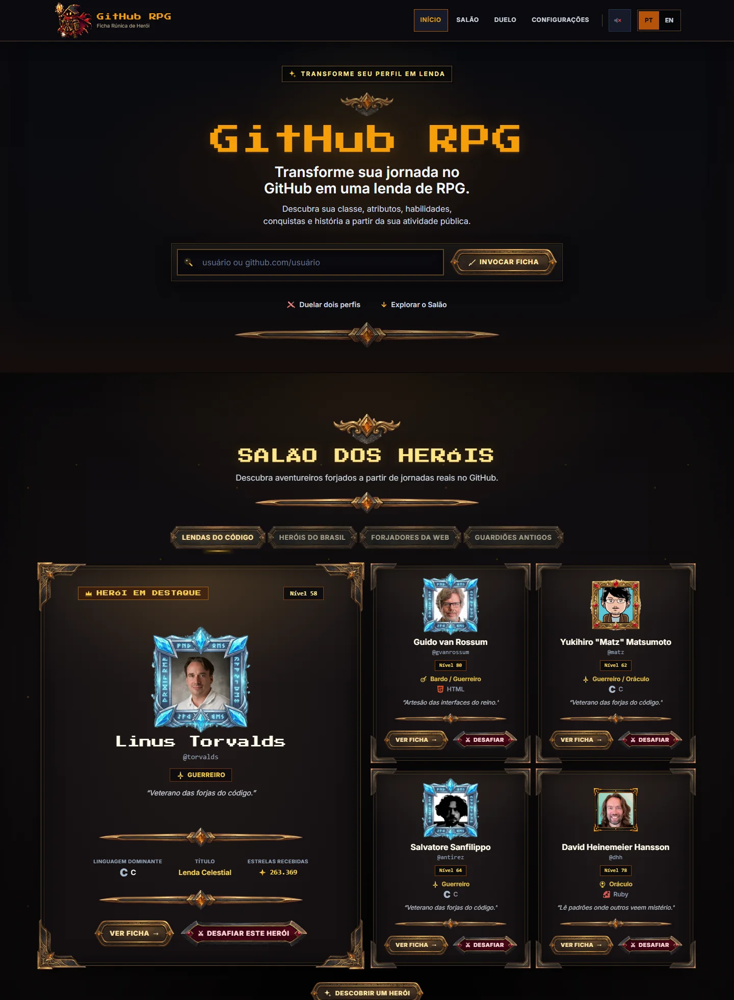

<div align="center">


# GitHub RPG

**Seu código conta uma história. Transforme-a em uma lenda.**

Transforme sua atividade pública no GitHub em uma ficha de personagem de RPG,
com classe, atributos, habilidades, conquistas e duelos.

[](https://nextjs.org/)
[](https://react.dev/)
[](https://www.typescriptlang.org/)
[](https://tailwindcss.com/)
[](LICENSE)

### [⚔️ Experimentar agora](https://githubrpg.vercel.app/) &nbsp;·&nbsp; [📜 Repositório](https://github.com/JonathanNwokolo/GitHubRPG)

<br />



</div>

<br />

## Sobre o projeto

Você digita um usuário do GitHub e recebe um personagem. O nível, a classe e os atributos não são sorteados: saem dos dados públicos do perfil, como repositórios, linguagens em bytes reais, estrelas e contribuições.

O estilo é dark fantasy em pixel art, com acabamento dourado e medieval sobre uma interface moderna. A ideia é transformar números de perfil em algo que dê vontade de explorar e compartilhar.

## Funcionalidades

| | |
| --- | --- |
| 🧙 **Ficha de personagem** | Nível, XP, classe e subclasse, atributos, títulos e conquistas. |
| 📖 **Grimório** | Linguagens viram habilidades, com afinidades e escolas. |
| 🏺 **Artefatos** | Padrões recorrentes identificados nos repositórios analisados. |
| 🕰️ **Crônica** | A história do perfil contada por capítulos, ano a ano. |
| ⚔️ **Duelos** | Confronte dois perfis lado a lado. |
| 🏰 **Salão dos Heróis** | Vitrine de perfis para explorar e desafiar. |
| 🏷️ **Badge para README** | Um SVG com sua ficha, pronto para colar no seu perfil. |

A interface está disponível em português e inglês.

### Badge para o seu README

```md
[](https://githubrpg.vercel.app/SEU_USUARIO)
```

## Como funciona

1. **Informe seu usuário GitHub.** Aceita `usuario` ou `github.com/usuario`.
2. **O sistema analisa seus dados públicos.** Perfil, repositórios, linguagens e contribuições passam por um Game Engine determinístico: o mesmo perfil gera sempre o mesmo personagem.
3. **Descubra seu personagem e explore o RPG.** Veja a ficha, leia sua crônica e desafie outro herói.

## Tecnologias

- **Next.js 15** (App Router) e **React 19**
- **TypeScript** e **Zod** para validação dos dados
- **Tailwind CSS**, **Motion** e **Lucide**
- **Zustand** para estado de interface
- **GitHub REST e GraphQL APIs**, consultadas apenas no servidor
- **Vitest**, **Testing Library** e **Playwright** para testes
- Deploy na **Vercel**

## Executando localmente

Requisitos: **Node.js 24** e npm (a mesma versão usada no CI e na Vercel).

```bash
git clone https://github.com/JonathanNwokolo/GitHubRPG.git
cd GitHubRPG
npm install
npm run dev
```

Abra [http://localhost:3000](http://localhost:3000). Em desenvolvimento, sem nenhuma configuração, o app usa **perfis de demonstração** (modo `mock`): não precisa de token nem de internet. Experimente `rookie-dev`, `veteran-dev` ou `polyglot-dev`.

### Usando perfis reais do GitHub

```bash
cp .env.example .env.local
```

Edite o `.env.local`:

```env
GITHUB_DATA_SOURCE=github
GITHUB_TOKEN=seu_token_aqui   # opcional
```

- `GITHUB_TOKEN` é **opcional** e fica só no servidor, nunca vai para o navegador. Use um token fine-grained somente leitura de repositórios públicos.
- Sem token, o app usa o REST anônimo (60 requisições/hora por IP) e as métricas de contribuição ficam indisponíveis.
- Em produção, definir `GITHUB_DATA_SOURCE` é obrigatório.

### Scripts

| Comando | Função |
| --- | --- |
| `npm run dev` | Servidor de desenvolvimento |
| `npm run build` · `npm start` | Build e servidor de produção |
| `npm run lint` | ESLint |
| `npm run typecheck` | Verificação de tipos |
| `npm test` | Testes unitários e de integração |
| `npm run test:e2e` | Testes end-to-end (rode o build antes; na primeira vez, `npx playwright install chromium`) |

## Sobre os dados

O GitHub RPG usa apenas **dados públicos** do GitHub. Classes, níveis, títulos e conquistas são uma **gamificação**, feita para ser divertida. Não medem talento, qualidade de código ou valor profissional de ninguém. O projeto é independente e não tem afiliação oficial com o GitHub, Inc.

## Documentação

- [Status de produção da Game Engine V2](docs/game-engine-v2/PRODUCTION_STATUS.md)
- [Integração com a API do GitHub](GITHUB_API_INTEGRATION.md)
- [Arquitetura do engine](docs/architecture/ENGINE_ARCHITECTURE.md) e [regras de balanceamento](docs/architecture/GAME_BALANCE.md)
- [CI e processo de release](docs/operations/CI.md)
- [Perfis de demonstração (mocks)](MOCKS.md)

## Contribuindo

Ideias, bugs e PRs são bem-vindos. Antes de abrir um PR, rode:

```bash
npm run lint && npm run typecheck && npm test
```

## Autor

**Jonathan Nwokolo**, [@JonathanNwokolo](https://github.com/JonathanNwokolo)

## Licença

Distribuído sob a licença [MIT](LICENSE).
